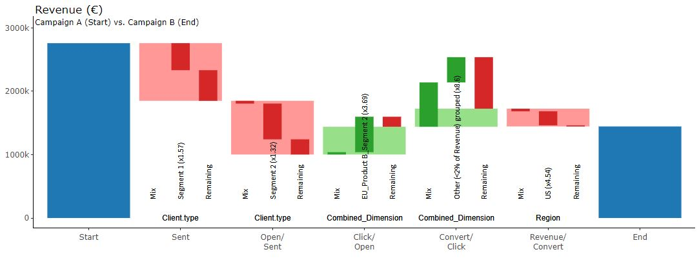

# Marketing Campaign

> Find below information about the **« Marketing – Campaign »**  example in our [demo](https://solutions.datama.fr/) solution.

Below is an extract of the data that has been used for this example. You can download the source: [Gsheet](https://docs.google.com/spreadsheets/d/1bNEeqm5CfpPmYPr_t4ff1xcJkSBKoVvwJd4vKB0sDzs/edit#gid=1286768317)

<iframe src="https://docs.google.com/spreadsheets/d/e/2PACX-1vTXYphkUS8WX6Wa4GZp5LBisnEOoqdLyp9darrXuIJPqmsnv_f8Tvhq_0sNX7L2uVfIaJjonTP2j8Fm/pubhtml?gid=1286768317&amp;single=true&amp;widget=true&amp;headers=false" width="920" height="440"></iframe>

## In DataMa Compare

Read our [article](https://datama.fr/fr/2019/04/11/comment-analyser-lefficacite-dune-campagne-demailing-2/) to better understand emailing campaign analysis

This use case is is a basic example of conversion funnel used for an email campaign. In that case DataMa Compare will help to compare 2 different campaign and identify the performance at each step of the two campaigns and understand from which element is mainly due this difference between each campaign.

**For example:** At the step : number of email « Open/Sent » the performance collapsed mainly due to the Segment 2 that less Opened the email in the Campaign B than in the Campaign A. (This could be seen in with the red bar in the middle)

The 2 other Marketing examples represent specific features available in our DataMa Compare solution (clustering of continuous dimension, and the ability to put some of the data aside – scope in / scope out):
* [Marketing Campaign – Continuous dimension](home/use_cases/marketing_continuous.md)
* [Marketing Campaign – Scope](home/use_cases/marketing_scope.md)
